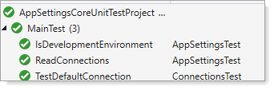
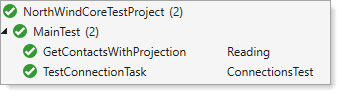

# About

Provides samples for using appsettings.json for .NET Core/C# 9 instead of using app.config


- Currently there is
    - A data provider example
    - A EF Core 5 example
- Proper usage is to keep, in this case SqlServerConnectionLibrary project in this solution, when needed for your solution reference this project's DLL

## SQL-Server data provider

For SQL-Server we have three environments  (same as EF Core)

```json
{
  "ConnectionStrings": {
    "DevelopmentConnection": "Data Source=.\\SQLEXPRESS;Initial Catalog=NorthWind2020;Integrated Security=True",
    "ProductionConnection": "Data Source=ProductionServer;Initial Catalog=NorthWind2020;Integrated Security=True",
    "TestConnection": "Data Source=TestServer;Initial Catalog=NorthWind2020;Integrated Security=True",
    "Environment": 2
  }
}
```

### There are three unit test



To get the default connection, in this case `Development`

```csharp
public static bool ConnectionTest()
{
    Helper.Initializer();
    
    using var cn = new SqlConnection() { ConnectionString = Helper.ConnectionString };

    try
    {
        cn.Open();
        return true;
    }
    catch (Exception)
    {
        return false;
    }
}
```

How are environments known

```csharp
public enum Environments
{
    Production,
    Test,
    Development
}
```

An enum is used rather than a string as a string can be mistyped and cause a runtime error.

Note that Helper.Initializer(); need only be called once in an application, not for each call.

**Example**

```csharp
using System.Data.SqlClient;
using SqlServerConnectionLibrary;

namespace AppSettingsCoreUnitTestProject.Classes
{
    public class SqlOperations
    {
        public static string ConnectionString = "";

        public static CustomerRelation GetCustomers()
        {

            InitializeConnection();
            
            CustomerRelation customer = new();

            var selectStatement = "TODO";

            using var cn = new SqlConnection() { ConnectionString = ConnectionString };
            using var cmd = new SqlCommand() { Connection = cn, CommandText = selectStatement };

            cn.Open();

            var reader = cmd.ExecuteReader();

            if (reader.HasRows)
            {
                reader.Read();
                customer.CustomerIdentifier = reader.GetInt32(0);
                customer.CompanyName = reader.GetString(1);
                customer.City = reader.GetString(2);
                customer.PostalCode = reader.GetString(3);
                customer.ContactId = reader.GetInt32(4);
                customer.CountryIdentifier = reader.GetInt32(5);
                customer.Country = reader.GetString(6);
                customer.Phone = reader.GetString(7);
                customer.PhoneTypeIdentifier = reader.GetInt32(8);
                customer.ContactPhoneNumber = reader.GetString(9);
                customer.ModifiedDate = reader.GetDateTime(10);
                customer.FirstName = reader.GetString(11);
                customer.LastName = reader.GetString(12);
            }

            return customer;

        }

        private static void InitializeConnection()
        {
            if (!string.IsNullOrWhiteSpace(ConnectionString)) return;
            Helper.Initializer();
            ConnectionString = Helper.ConnectionString;
        }
    }
}
```

## SQL-Server Entity Framework Core

For SQL-Server we have three environments (same as data provider)

```json
{
  "ConnectionStrings": {
    "DevelopmentConnection": "Data Source=.\\SQLEXPRESS;Initial Catalog=NorthWind2020;Integrated Security=True",
    "ProductionConnection": "Data Source=ProductionServer;Initial Catalog=NorthWind2020;Integrated Security=True",
    "TestConnection": "Data Source=TestServer;Initial Catalog=NorthWind2020;Integrated Security=True",
    "Environment": 2
  }
}
```
In the [DbContext](https://docs.microsoft.com/en-us/dotnet/api/system.data.entity.dbcontext?view=entity-framework-6.2.0)

In OnConfiguring there are two possibilities, one `without logging` via Debug.WriteLine and the other `with logging` to Debug.WriteLine. 


```csharp
protected override void OnConfiguring(DbContextOptionsBuilder optionsBuilder)
{
    if (!optionsBuilder.IsConfigured)
    {
        Helper.Initializer();
        NoLogging(optionsBuilder);
    }
}
private static void LogQueryInfoToDebugOutputWindow(DbContextOptionsBuilder optionsBuilder)
{
    optionsBuilder.UseSqlServer(Helper.ConnectionString)
        .EnableSensitiveDataLogging()
        .LogTo(message => Debug.WriteLine(message));
}
private static void NoLogging(DbContextOptionsBuilder optionsBuilder)
{
    optionsBuilder.UseSqlServer(Helper.ConnectionString);
}
```

There are other options which are not presented here like setting up an environment variable as per below which will be provided in the next iteraton of this repository. What is most important, keeping the connection string out of the DbContext.

```csharp
IConfigurationBuilder builder = new ConfigurationBuilder()         
    .AddJsonFile($"appsettings.{Environment.GetEnvironmentVariable("ASPNETCORE_ENVIRONMENT")}.json", optional: true)
    .AddEnvironmentVariables();

IConfigurationRoot config = builder.Build();
```

What else is left? Encrypting the connection string in appsettings.json, also coming up in the next iteration of the repository.

## NuGet packages

In the project file for NortWindCoreLibrary, the Logging packages are needed. Either copy to your project file or install from NuGet.

- [Microsoft.Extensions.Logging](https://www.nuget.org/packages/Microsoft.Extensions.Logging/6.0.0-preview.6.21352.12)
- [Microsoft.Extensions.Logging.Debug](https://www.nuget.org/packages/Microsoft.Extensions.Logging.Debug/6.0.0-preview.6.21352.12)


```xml
<ItemGroup>
    <PackageReference Include="Microsoft.EntityFrameworkCore.SqlServer" Version="5.0.8" />
    <PackageReference Include="Microsoft.Extensions.Logging" Version="5.0.0" />
    <PackageReference Include="Microsoft.Extensions.Logging.Debug" Version="5.0.0" />
  </ItemGroup>
```  

### Unit test

There are two unit test, one to test the connection while the other reads back data using a projection.

- Uses [DeepEqual](https://www.nuget.org/packages/DeepEqual/) NuGet package in `GetContactsWithProjection` test.



```csharp
namespace NorthWindCoreTestProject
{
    [TestClass]
    public partial class MainTest : TestBase
    {
        [TestMethod]
        [TestTraits(Trait.ConnectionsTest)]
        public async Task TestConnectionTask()
        {
            await using var context = new NorthwindContext();
            Assert.IsTrue(await context.TestConnection());
        }

        [TestMethod]
        [TestTraits(Trait.Reading)]
        public async Task GetContactsWithProjection()
        {
            
            await using var context = new NorthwindContext();
            
            List<ContactItem> contacts = await ContactOperations.GetContactsWithProjection();

            var firstContact = contacts.FirstOrDefault();
            var expected = contact;
            
            /*
             * Assert two ContactItem are the same
             */
            firstContact.ShouldDeepEqual(expected);


        }
    }
}

```

For testing connections, the following two extension methods are available and were one is used above.

See [CanConnectAsync](https://docs.microsoft.com/en-us/dotnet/api/microsoft.entityframeworkcore.storage.idatabasecreator.canconnectasync?view=efcore-5.0) docs

```csharp
namespace NorthWindCoreLibrary.LanguageExtensions
{
    public static class DbContextExtensions
    {
        /// <summary>
        /// Determine if a connection can be made asynchronously
        /// </summary>
        /// <param name="context"><see cref="DbContext"/></param>
        /// <returns></returns>
        public static async Task<bool> TestConnection(this DbContext context) =>
            await Task.Run(async () => await context.Database.CanConnectAsync());

        /// <summary>
        /// Determine if a connection can be made asynchronously with <see cref="CancellationToken"/>
        /// </summary>
        /// <param name="context"><see cref="DbContext"/></param>
        /// <param name="token">&lt;see cref="CancellationToken"/&gt;</param>
        /// <returns></returns>
        public static async Task<bool> TestConnection(this DbContext context, CancellationToken token) =>
            await Task.Run(async () => await context.Database.CanConnectAsync(token), token);
    }
}
```

